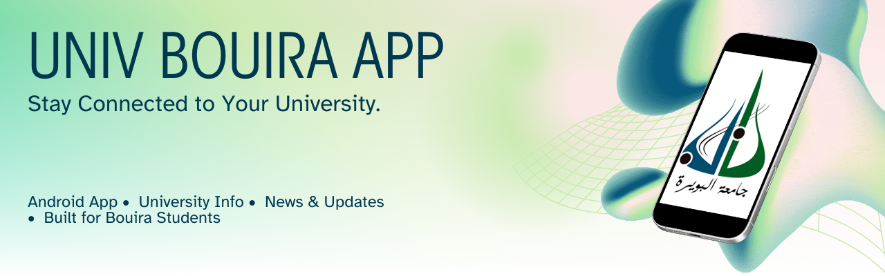

# University of Bouira Mobile Application

<p align="center">
  
</p>

<p align="center">
  <a href="https://github.com/AmaraSami/univ-bouira-app/stargazers">
    
  </a>
  <a href="https://github.com/AmaraSami/univ-bouira-app/network/members">
    
  </a>
  <a href="https://github.com/AmaraSami/univ-bouira-app/watchers">
    
  </a>
  <a href="https://github.com/AmaraSami/univ-bouira-app">
    
  </a>
</p>


## Overview

The University of Bouira Mobile Application is a comprehensive platform designed to connect students, professors, and administrative staff at the University of Bouira. This Android application streamlines academic processes, enhances communication, and provides essential tools for the university community.

**Note:** This application was developed as a graduation project for a Bachelor's degree program at the University of Bouira.

## Features

### For Students
- **Class Schedules**: Access personalized class timetables with location information
- **Grade Tracker**: View grades and academic progress
- **Document Access**: Download lecture materials, syllabi, and academic resources

### For Professors
- **Course Management**: manage course content and materials
- **Grade Management**: Input and update student grades
- **Resource Sharing**: Upload course materials and resources

### For Administration
- **Academic Calendar**: Manage and update the academic calendar
- **Data Analytics**: Access statistics about student performance and attendance

## Screenshots

(TODO : Add app Screenshots)

## Technology Stack
- **Frontend**: Native Android (Kotlin/Java)
- **Database**: Firebase

## Prerequisites
- API 23 or higher
- Active internet connection
- University of Bouira email address


### Student Access
1. Log in with your student credentials
2. Access your personalized dashboard
3. View your schedule, and course materials


### Professor Access
1. Log in with your faculty credentials
2. Manage your courses from the dashboard
3. Update grades, attendance, and course materials

## Development

### Setup Development Environment
1. Clone the repository
```bash
git clone https://github.com/AmaraSami/univ-bouira-app.git
```
2. Open the project in Android Studio
3. Sync Gradle files and install dependencies
4. Configure your local environment variables for API access

### Project Structure
```
univ-bouira-app/
├── app/
│   ├── src/
│   │   ├── main/
│   │   │   ├── java/           # Kotlin/Java source files
│   │   │   ├── res/            # Resources (layouts, drawables, etc.)
│   │   │   └── AndroidManifest.xml
│   │   └── test/               # Test files
│   ├── build.gradle            # App-level build configuration
│   └── proguard-rules.pro      # ProGuard rules
├── gradle/                     # Gradle wrapper
├── build.gradle                # Project-level build configuration
└── README.md                   # Project documentation
```

### Contributors and their Contacts:
- Amara Sami Anis - samianis.amara@univ-bouira.dz
- Meziane Akram   - akram.meziane@univ-bouira.dz
- Rezouali Raouf  - raouf.rezouali@univ-bouira.dz

## Contact and Support
For assistance with the application:

- **Technical Support**:  samianis.amara@univ-bouira.dz
- **Bug Reports**: Please submit via the GitHub Issues tab

## License

This project is licensed under the MIT License - see the LICENSE file for details.

## Acknowledgments

- University of Bouira IT Department
- Student Technology Advisory Committee
- Faculty Technology Committee
- All beta testers and early adopters
